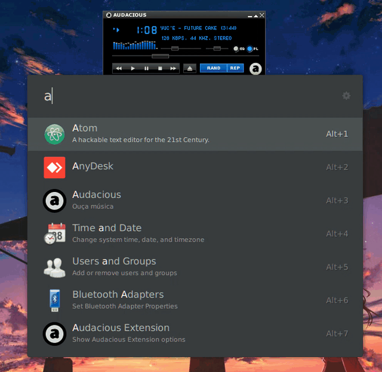

# audacious-player
Controls Audacious Music Player using ULauncher.

## Installation
_**Note:** You need [Audacious](https://audacious-media-player.org/) installed on your machine and `audtool` added to your system PATH_
 1. Open `Ulauncher` > `Preferences` > `Add Extension`
 2. Add repository: `https://github.com/Guaxinim5573/audacious-player`
 3. Open **Audacious** and start listening to music
 4. **Starting using your new extension!**

## Features

 - Search music form current playlist
 - Play/Pause
 - Change volume
 - Next/Prev music
 - See playlist
 - Current song

## Credits
_Some icons was made by [Freepik](https://www.flaticon.com/authors/freepik) from [www.flaticon.com](https://www.flaticon.com/authors/freepik)_